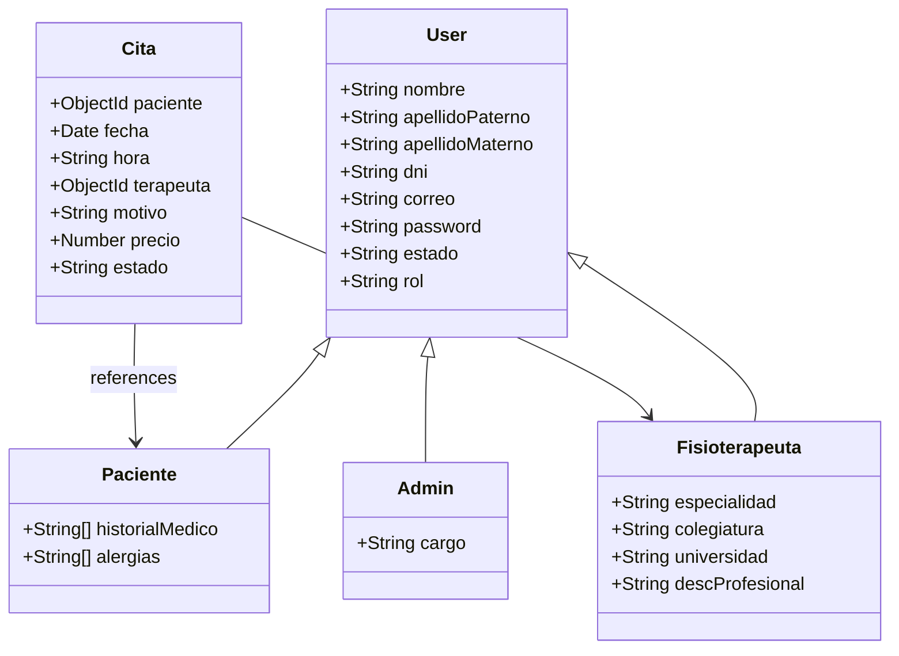

## Overview

The Fisioterapia API uses **Mongoose** as the ODM (Object Document Mapper) for MongoDB. The data models use advanced Mongoose features including discriminators for polymorphic user types and population for relational data.

## User Model Hierarchy

The API uses Mongoose's **discriminator pattern** to implement inheritance for different user types. All users share a base schema, with role-specific fields added through discriminators.

### Base User Model

The base user schema defines common fields shared by all user types:

```javascript
// src/models/usuarioModel.js
import mongoose from "mongoose";

const options = { discriminatorKey: "rol", collection: "user"}

const userSchema = mongoose.Schema({
  nombre: String,
  apellidoPaterno: String,
  apellidoMaterno: String,
  dni: {
    type: String,
    unique: true,
    required: true
  },
  cumpleanios: String,
  genero: String,
  img: String,
  celular: String,
  direccion: String,
  correo: {
    type: String,
    unique: true
  },
  password: {
    type: String,
    required: true
  },
  estado: {
    type: String,
    enum: ["activo", "inactivo"],
    default: "activo"
  }
}, options)

export const userModel = mongoose.model("user", userSchema)
```

<Info>
The `discriminatorKey: "rol"` option tells Mongoose to use a field called `rol` to differentiate between user types. All user types are stored in the same `"user"` collection.
</Info>

#### Base User Fields

| Field | Type | Required | Unique | Description |
|-------|------|----------|--------|-------------|
| `nombre` | String | No | No | First name |
| `apellidoPaterno` | String | No | No | Paternal surname |
| `apellidoMaterno` | String | No | No | Maternal surname |
| `dni` | String | Yes | Yes | National ID number |
| `cumpleanios` | String | No | No | Date of birth |
| `genero` | String | No | No | Gender |
| `img` | String | No | No | Profile image URL |
| `celular` | String | No | No | Phone number |
| `direccion` | String | No | No | Address |
| `correo` | String | No | Yes | Email address |
| `password` | String | Yes | No | Hashed password |
| `estado` | String | No | No | Account status (activo/inactivo) |
| `rol` | String | Auto | No | Discriminator field (paciente/fisioterapeuta/admin) |

### Paciente Model (Patient)

Patients extend the base user model with medical history fields:

```javascript
// src/models/pacienteModel.js
import mongoose from "mongoose";
import { userModel } from "./usuarioModel.js";

const pacienteSchema = new mongoose.Schema({
  historialMedico: [String],
  alergias: [String]
});

export const pacienteModel = userModel.discriminator("paciente", pacienteSchema);
```

#### Additional Paciente Fields

| Field | Type | Description |
|-------|------|-------------|
| `historialMedico` | String[] | Array of medical history entries |
| `alergias` | String[] | Array of known allergies |

<Note>
When querying `pacienteModel`, Mongoose automatically filters for documents where `rol === "paciente"`.
</Note>

### Fisioterapeuta Model (Physiotherapist)

Physiotherapists have professional credential fields:

```javascript
// src/models/fisioModel.js
import mongoose from "mongoose";
import { userModel } from "./usuarioModel.js";

const fisioterapeutaSchema = new mongoose.Schema({
  especialidad: String,
  colegiatura: String,
  universidad: String,
  descProfesional: String
});

export const fisioModel = userModel.discriminator("fisioterapeuta", fisioterapeutaSchema);
```

#### Additional Fisioterapeuta Fields

| Field | Type | Description |
|-------|------|-------------|
| `especialidad` | String | Area of specialization |
| `colegiatura` | String | Professional license number |
| `universidad` | String | University/institution |
| `descProfesional` | String | Professional description/bio |

### Admin Model

Administrators have a role-specific position field:

```javascript
// src/models/adminModel.js
import mongoose from "mongoose";
import { userModel } from "./usuarioModel.js";

const adminSchema = mongoose.Schema({
  cargo: {
    type: String,
    enum: ["gerente", "cajero", "recepcionista"]
  }
})

export const adminModel = userModel.discriminator("admin", adminSchema)
```

#### Additional Admin Fields

| Field | Type | Enum Values | Description |
|-------|------|-------------|-------------|
| `cargo` | String | gerente, cajero, recepcionista | Administrative position |

## Cita Model (Appointment)

The appointment model manages physiotherapy session bookings with references to patients and therapists:

```javascript
// src/models/citasModel.js
import mongoose from "mongoose";

const citaSchema = new mongoose.Schema({
  paciente: {
    type: mongoose.Schema.Types.ObjectId,
    ref: "paciente",
    required: true,
  },
  fecha: {
    type: Date,
    required: true,
  },
  hora: {
    type: String,
    required: true,
  },
  terapeuta: {
    type: mongoose.Schema.Types.ObjectId,
    ref: "fisioterapeuta",
    required: true,
  },
  motivo: {
    type: String,
  },
  precio: {
    type: Number,
    default: 60
  },
  estado: {
    type: String,
    enum: ["pendiente", "confirmada", "cancelada", "completada"],
    default: "pendiente",
  },
});

export const citaModel = mongoose.model("cita", citaSchema);
```

### Cita Fields

| Field | Type | Required | Default | Description |
|-------|------|----------|---------|-------------|
| `paciente` | ObjectId | Yes | - | Reference to patient user |
| `fecha` | Date | Yes | - | Appointment date |
| `hora` | String | Yes | - | Appointment time |
| `terapeuta` | ObjectId | Yes | - | Reference to physiotherapist |
| `motivo` | String | No | - | Reason for appointment |
| `precio` | Number | No | 60 | Session price |
| `estado` | String | No | "pendiente" | Appointment status |

#### Estado (Status) Values

- **pendiente**: Appointment requested but not confirmed
- **confirmada**: Appointment confirmed by therapist
- **cancelada**: Appointment cancelled
- **completada**: Session completed

## Relationships and Population

The API uses Mongoose's `populate()` method to resolve ObjectId references:

### Creating a Cita with Population

```javascript
// src/DAO/citaDao.js
async createCita(data) {
  const cita = await citaModel.create(data)
  
  const citaCreated = await citaModel.findById(cita._id)
                            .populate("paciente")
                            .populate("terapeuta")
  return citaCreated
}
```

### Querying Citas with Selective Population

```javascript
// Populate only specific fields
async leerCita() {
  return await citaModel.find()
      .populate("paciente", "nombre apellidoPaterno dni")
      .populate("terapeuta", "nombre apellidoPaterno especialidad");
}
```

<Tip>
Use selective population by passing a second argument to `populate()` to limit the fields returned and improve performance.
</Tip>

### Finding Citas by Therapist

```javascript
async getCitaIdFisi(terapeutaId) {
  return await citaModel
                      .find({ terapeuta: terapeutaId })
                      .populate("paciente", "nombre apellidoPaterno apellidoMaterno")
                      .populate("terapeuta", "nombre apellidoPaterno apellidoMaterno")
}
```

### Finding Citas by Patient

```javascript
async getCitaIdPac(pacienteId) {
  return await citaModel
                      .find({ paciente: pacienteId })
                      .populate("paciente", "nombre apellidoPaterno apellidoMaterno")
                      .populate("terapeuta", "nombre apellidoPaterno apellidoMaterno")
}
```

## Data Model Diagram



## Working with the Discriminator Pattern

### Creating Different User Types

```javascript
// Create a patient
const patient = await pacienteModel.create({
  nombre: "Juan",
  dni: "12345678",
  correo: "juan@example.com",
  password: "hashedPassword",
  historialMedico: ["Diabetes tipo 2"],
  alergias: ["Penicilina"]
  // rol is automatically set to "paciente"
})

// Create a physiotherapist
const fisio = await fisioModel.create({
  nombre: "Maria",
  dni: "87654321",
  correo: "maria@example.com",
  password: "hashedPassword",
  especialidad: "Traumatología",
  colegiatura: "CMP-12345"
  // rol is automatically set to "fisioterapeuta"
})
```

### Querying by Role

```javascript
// Query all patients
const patients = await pacienteModel.find()

// Query all physiotherapists
const therapists = await fisioModel.find()

// Query all users (regardless of role)
const allUsers = await userModel.find()

// Query specific role using base model
const admins = await userModel.find({ rol: "admin" })
```

<Warning>
Always use the specific discriminator model (`pacienteModel`, `fisioModel`, `adminModel`) when creating documents to ensure the `rol` field is set correctly.
</Warning>

## Database Collection Structure

### Users Collection

All user types are stored in a single `user` collection:

```json
[
  {
    "_id": "507f1f77bcf86cd799439011",
    "nombre": "Juan",
    "dni": "12345678",
    "correo": "juan@example.com",
    "rol": "paciente",
    "historialMedico": ["Diabetes tipo 2"],
    "alergias": ["Penicilina"]
  },
  {
    "_id": "507f1f77bcf86cd799439012",
    "nombre": "Maria",
    "dni": "87654321",
    "correo": "maria@example.com",
    "rol": "fisioterapeuta",
    "especialidad": "Traumatología",
    "colegiatura": "CMP-12345"
  }
]
```

### Citas Collection

```json
[
  {
    "_id": "507f1f77bcf86cd799439020",
    "paciente": "507f1f77bcf86cd799439011",
    "terapeuta": "507f1f77bcf86cd799439012",
    "fecha": "2024-03-15T00:00:00.000Z",
    "hora": "10:00",
    "motivo": "Dolor lumbar",
    "precio": 60,
    "estado": "confirmada"
  }
]
```

## Best Practices

<CardGroup cols={2}>
  <Card title="Use Discriminators" icon="sitemap">
    Leverage discriminators for polymorphic relationships instead of separate collections
  </Card>
  
  <Card title="Selective Population" icon="filter">
    Only populate fields you need to reduce query overhead
  </Card>
  
  <Card title="Validate at Schema Level" icon="shield-check">
    Use Mongoose validators for data integrity
  </Card>
  
  <Card title="Index Common Queries" icon="magnifying-glass">
    Add indexes on frequently queried fields like `dni`, `correo`, and `rol`
  </Card>
</CardGroup>

<Check>
**Type Safety**: Consider using TypeScript with Mongoose schemas for compile-time type checking.
</Check>